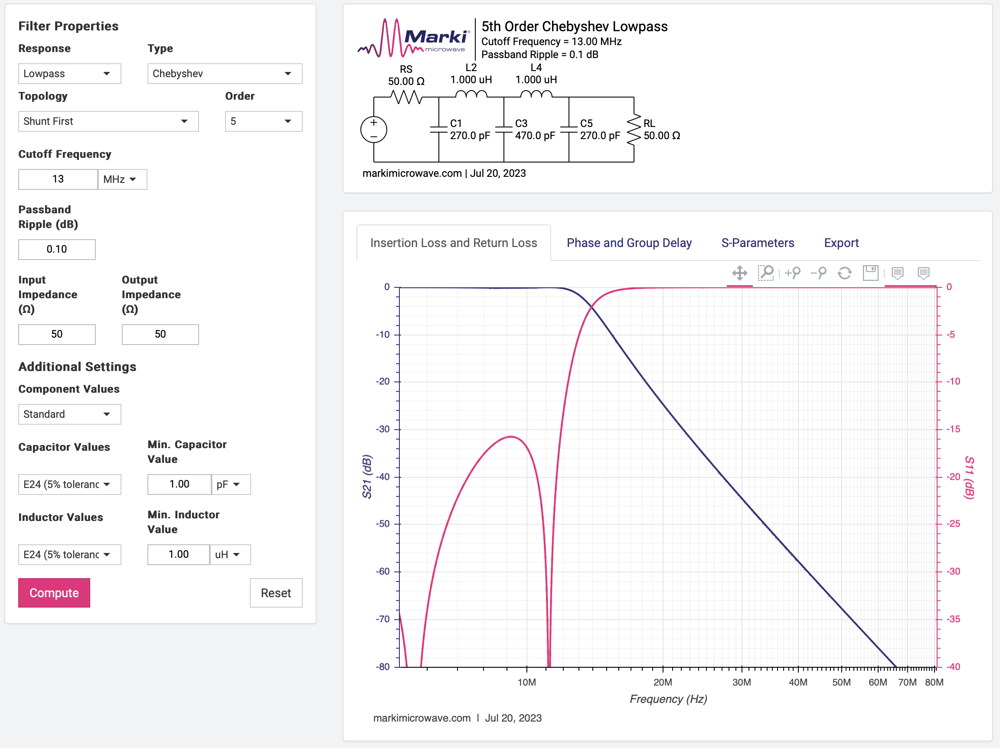

Design parameters:

* Control with a DAC instead of a potmeter.
* Microcontroller: as cheap as possible?

    * [PY32003 in SOP-8 package](https://www.lcsc.com/product-detail/Microcontroller-Units-MCUs-MPUs-SOCs_PUYA-PY32F003L16S6TU_C5128435.html)

        32KB flash, 4KB RAM

        24MHz

        1.7-5.5V

        12-bit ADC

    * SOP-8 pinout:

        1 - VCC
        2 - 
        3 -
        4 - USART1_TX
        5 -
        6 - SWDIO
        7 -
        
* Temperature sensor
* Voltage reference (or use OCXO internal one)

    * [TL431BVDR2G](https://www.mouser.com/ProductDetail/onsemi/TL431BVDR2G?qs=xZq1yRCsb1eLd6xafxrLew%3D%3D)

        * SOIC-8
        * 1 to 100mA sink current
        * +-0.4% voltage reference tolerance

* 12V power regulator

    * [MC7812-TO220](https://www.mouser.com/ProductDetail/onsemi/MC7812BTG?qs=%252B9%2Fcbd0IE0QD0Q8bJHvPNQ%3D%3D)

Similar projects

* [Build a 10MHz OCXO for the shack for less than $40.00](http://www.sadarc.org/xenforo/upload/index.php?threads/build-a-10mhz-ocxo-for-the-shack-for-less-than-40-00.138/post-866)

    Uses a CTI OSC5A2B02. 4 outputs.

    The output filter might have been designed by [this RF filter design tool](https://rf-tools.com/lc-filter/)

    
    

* [Building a 10MHz Master Clock](https://www.paulvdiyblogs.net/2023/07/building-10mhz-master-clock.html)

* [10MHz OCXO Master Clock nabouw topic](https://www.circuitsonline.net/forum/view/126987/1)

